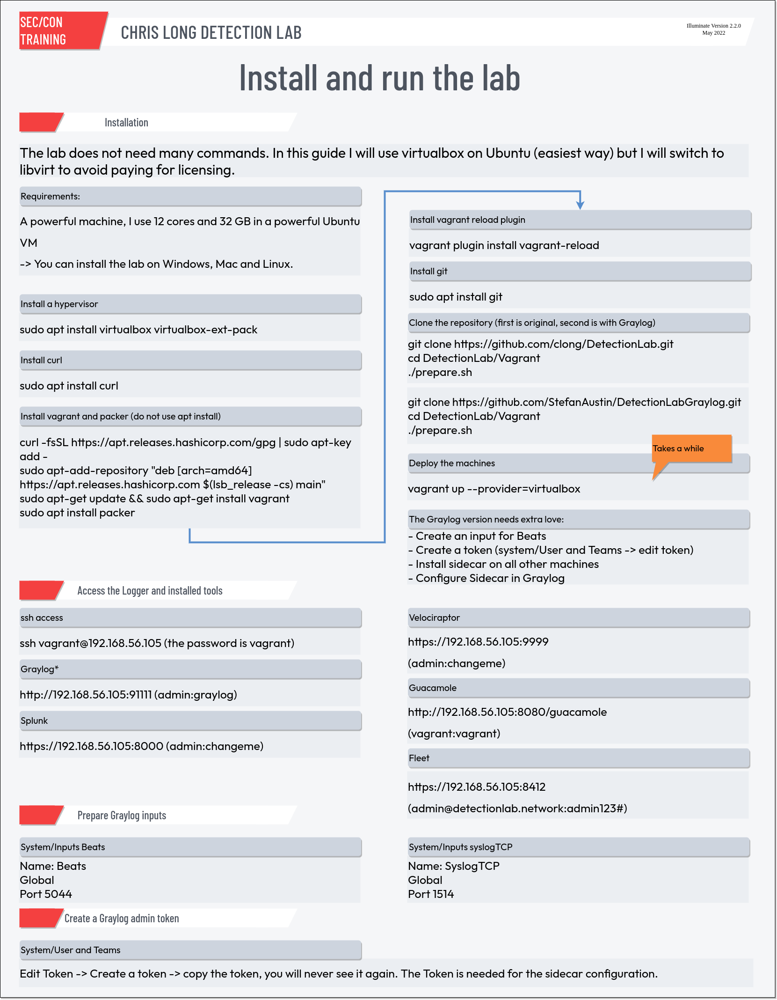

# Detection Lab

This is a fork. The original lab runs with Splunk and most people might not have the money for a licence. This lab will have a Graylog instance in it. Right now, I cannot set it to private, so it will not work as expected.

#### Donate to the project:

All of the infrastructure, building, and testing of the original DetectionLab is currently funded by Chris Long in his spare time. If you find this project useful, feel free to buy him a coffee using one of the buttons below!

This is not an official project, but his work is awesome!

 [$5](https://github.com/login?return_to=%2Fsponsors%2Fclong%2Fsponsorships%3Ftier_id%3D89561) | [$20](https://github.com/login?return_to=%2Fsponsors%2Fclong%2Fsponsorships%3Ftier_id%3D89562) | [$100](https://github.com/login?return_to=%2Fsponsors%2Fclong%2Fsponsorships%3Ftier_id%3D97537)

## Purpose
This lab has been designed with defenders in mind. Its primary purpose is to allow the user to quickly build a Windows domain that comes pre-loaded with security tooling and some best practices when it comes to system logging configurations. It can easily be modified to fit most needs or expanded to include additional hosts.

Read more about Detection Lab on Medium here: https://medium.com/@clong/introducing-detection-lab-61db34bed6ae

NOTE: This lab has not been hardened in any way and runs with default vagrant credentials. Please do not connect or bridge it to any networks you care about. This lab is deliberately designed to be insecure; the primary purpose of it is to provide visibility and introspection into each host.

